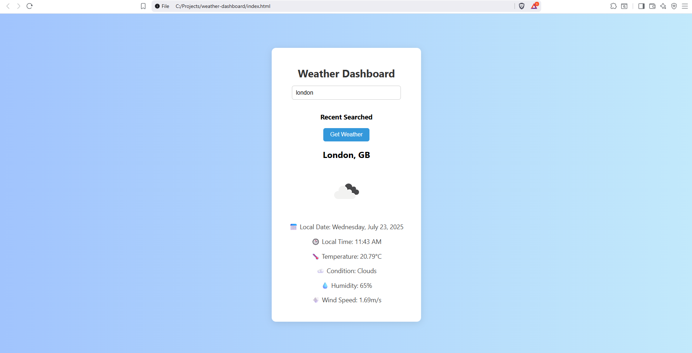

# 🌦 Weather Dashboard

A simple and responsive web app that shows real-time weather data for any city, using the OpenWeatherMap API.

---

## 🚀 Features

- 🌍 Search weather by city
- 📅 Shows local date and time of the searched city
- 🌡 Displays temperature, weather conditions, humidity, and wind speed
- 🔁 Remembers recent searches using localStorage
- 🖱 Right-click any recent city to delete it

---

## 🧪 Technologies Used

- HTML
- CSS
- JavaScript (vanilla)
- OpenWeatherMap API

---

## 📷 Demo Preview

---

## 📌 How to Use

1. Enter a city name (e.g., Delhi, New York)
2. Click *"Get Weather"*
3. View weather details, time, and date
4. Click a previous city to recheck, or right-click to delete

---

## 📥 Future Updates

> Planned improvements:

- 🌙 Dark Mode toggle
- 📍 Use browser *geolocation* to fetch weather
- 🌐 Show country flags alongside city name
- 🔄 Toggle between °C and °F
- 📱 Better mobile responsiveness
- 🔧 Error handling for invalid or blank input

---

## 🧑‍💻 Author

*Rishabh Akash*  
[viper8890](https://github.com/viper8890)  
Project Date: July 2025

---

## 📃 License

MIT License